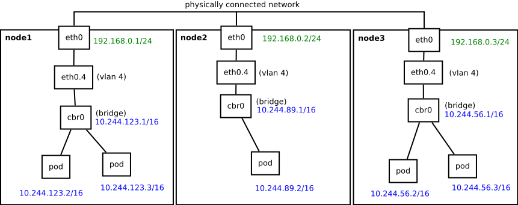

# bridget


Simple bridge network for kubernetes 


## How it works

bridget - it's short shell script, that helps you for organise simple bridge network for Kubernetes.
There is no overlays, no politics. Just flat L2-network across all your hosts and pods.

In addition bridget can automatically configure VLAN and bridge interfaces for that. See the picture:



bridget automatically retrieves node cidr from your pod-network, and configures cni for use it.

## Parameters

All parameters passing as environment variables:

 - **BRIDGE** *(example: `cbr0`)* - Bridge name. Mandatory option.
 - **VLAN** *(example: `100`)* - VLAN id. If set, the new vlan-interface under IFACE will be created, then added to BRIDGE.
 - **IFACE** *(example: `eth0`)* - Physical interface for connect to bridge. Mandatory if VLAN is set, but can be used singly.
 - **MTU** *(default: `1500`)* - MTU value for cni config
 - **CHECK_SLAVES** *(example: `1`)* - Make bridget for configure slave interfaces, if bridge already exists.
 - **POD_NETWORK** *(default: `10.244.0.0/16`)* - Your pod network.
 - **DEBUG** *(example: `1`)* - Enable verbose output.

## Quick start

* Instantiate your kubernetes with `--pod-network-cidr=10.244.0.0/16` flag.

* Download yaml file:
```
curl -O https://raw.githubusercontent.com/kvaps/bridget/master/bridget.yaml
```

* Edit wanted parameters:
```
vim bridget.yaml
```

By default bridget uses `cbr0` bridge that nowhere connected, so you need to set IFACE and VLAN parameters, or configure your host system for connect physical interface this bridge byself.
Please make sure that you have no any IP-address on the bridge, because it will be configured automatcally.

* Run daemonset:
```
kubectl create -f bridget.yaml
```

## Update

* Check your `bridget.yaml` for changes.

* Run:
```
kubectl delete -f bridget.yaml
kubectl create -f bridget.yaml
```

## Alternatives

There is not much alternatives for kubernetes if you want to use flat L2-network.

As a rule, if such solutions are provided, like L2-modes for [flannel](https://github.com/coreos/flannel) or [romana](https://github.com/romana/romana), it's still use difficult rules for nating and routing. Thanks to that you have flexible policies and some other things, but lose simplicity and productivity of simple L2-network.

Bridget was created under [pipework](https://github.com/jpetazzo/pipework)'s inspiration.
pipework allows you to add single interfaces into your containers, but you need to do extra actions for achieve this.
Besides Kubernetes knows nothing about any changes from this side.

Unlike pipework bridget uses [CNI](https://github.com/containernetworking/cni) for configuring pod interfaces, as a result all configuration occurs automatically, and kubernetes gets right IP-addresses.

As alternative you can also consider сreate your own CNI configuration with [bridge](https://github.com/containernetworking/plugins/tree/master/plugins/main/bridge) or [macvlan](https://github.com/containernetworking/plugins/tree/master/plugins/main/macvlan) plugin for each your host.

## Contact

* Author: [kvaps](mailto:kvapss@gmail.com)
* Bugs: [issues](https://github.com/kvaps/bridget/issues)

## Contributing

To contribute bug patches or new features, you can use the github Pull Request model. It is assumed that code and documentation are contributed under the Apache License 2.0. 

## Reporting bugs

Please use github issue-tracker for submit bugs

## License

bridget is under the Apache 2.0 license. See the [LICENSE](LICENSE) file for details.
